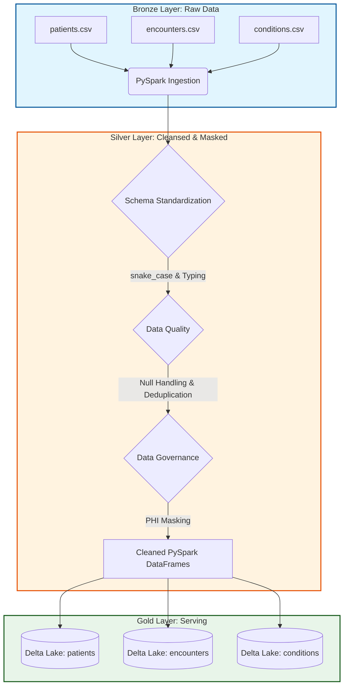

# Phase 1: Data Engineering & Foundation Architecture

> [!IMPORTANT]
> The objective of Phase 1 is to ingest raw synthetic healthcare data (Synthea CSVs), perform transformations, enforce data quality, apply PHI masking, and materialize the output as optimized Delta tables. This layer serves as the single source of truth for the Text-to-SQL engine in Phase 2.

## Pipeline Architecture


## Technical Implementation Steps

### 1. Data Ingestion (Bronze Layer)
- **Objective:** Ingest discrete CSV files into Spark memory.
- **Rationale:** PySpark provides distributed memory capabilities necessary for scalable data engineering. 
- **Implementation:**
  ```python
  df_patients = spark.read.format("csv").option("header", "true").option("inferSchema", "true").load(csv_path)
  ```

### 2. Schema Standardization
- **Objective:** Normalize schema syntax for optimum LLM accuracy.
- **Rationale:** LLMs generate SQL based on predictable table structures. Inconsistent casing (e.g., `BIRTHDATE` vs `birth_date`) increases SQL generation failure rates.
- **Implementation:** 
  Map all columns to `snake_case` using PySpark `withColumnRenamed`. Cast timestamps where `inferSchema` defaulted to strings.

### 3. Data Quality & Cleansing
- **Objective:** Neutralize missing values and exact duplicates.
- **Rationale:** `NULL` values in numerical or aggregatable fields can crash downstream Spark SQL operations generated by the LLM.
- **Implementation:**
  - `df.dropDuplicates()`
  - Handle nulls contextually: `df.fillna("UNKNOWN", subset=["marital_status"])`
  - > [!WARNING]
    > Do not universally drop rows with `NULL`s, as healthcare events (like missing `death_date`) are valid states.

### 4. Data Governance & PHI Protection
- **Objective:** Mask Personally Identifiable Information (PHI) while preserving table topology.
- **Rationale:** Fulfills the "Enterprise Governance" theme. Prevents sensitive data leakage to external LLM APIs during Phase 2. 
- **Implementation:**
  - Apply static masking to sensitive fields:
  ```python
  from pyspark.sql.functions import lit
  df_patients_masked = df_patients.withColumn("first", lit("***")).withColumn("last", lit("***")).withColumn("address", lit("[REDACTED]"))
  ```
  - > [!TIP]
    > Unlike dropping columns, masking retains the original schema footprint. This is critical for testing the drift-detection algorithms in Phase 3.

### 5. Relational Integrity Maintenance
- **Objective:** Preserve key relationships for downstream SQL `JOIN` statements.
- **Implementation:** Ensure that primary and foreign keys (e.g., UUIDs like `patient_id`, `encounter_id`) run through the pipeline unmodified.

### 6. Delta Table Materialization (Gold Layer)
- **Objective:** Write the cleansed data out in Delta format.
- **Rationale:** Delta format provides ACID transactions and supports `mergeSchema`. This enables the native schema evolution tracking required for Phase 3.
- **Implementation:**
  ```python
  df_patients_masked.write.format("delta").mode("overwrite").saveAsTable("project_genie.patients")
  ```

### 7. Post-Load Validation
- **Objective:** Programmatically verify pipeline health.
- **Implementation:**
  Execute integration queries via `spark.sql()` to ensure mapping integrity:
  ```sql
  SELECT p.patient_id, e.encounter_id 
  FROM project_genie.patients p 
  JOIN project_genie.encounters e ON p.patient_id = e.patient_id 
  LIMIT 5;
  ```
